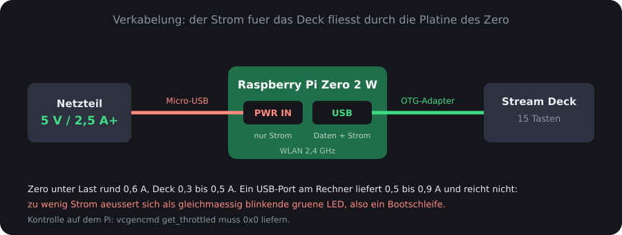

# 1 — Hardware und Stromversorgung

[← Zurück zur Übersicht](../README.md)

## Was gebraucht wird

| Teil | Anmerkung |
|---|---|
| Elgato Stream Deck | getestet mit dem 15-Tasten-Modell, USB-Kennung `0fd9:006d` |
| Raspberry Pi Zero 2 W | Cortex-A53, damit ARM64-fähig; WLAN nur 2,4 GHz |
| Micro-USB-OTG-Adapter | verbindet den Port `USB` mit dem USB-A-Stecker des Decks |
| Netzteil 5 V, mindestens 2,5 A | mit kurzem, dickem Micro-USB-Kabel |
| microSD-Karte | 8 GB genügen |

## Warum kein ESP32

Die Frage stellt sich, weil ein ESP32 billiger und sparsamer wäre. Er scheidet
aber aus technischen Gründen aus:

- **ESP32, ESP32-C3, ESP32-C6** haben überhaupt keinen USB-Host. Sie können
  selbst *Gerät* an einem Rechner sein, aber kein Gerät bedienen.
- **ESP32-S3** hat zwar USB-OTG, es gibt aber keine brauchbare
  HID-Host-Bibliothek für herstellerspezifische Geräte. Das Stream Deck meldet
  sich als „Vendor Specific Class" und spricht ein eigenes Protokoll.

Ein Raspberry Pi bringt einen vollwertigen USB-Host und `libusb` mit. Damit
funktioniert die fertige Bibliothek
[`python-elgato-streamdeck`](https://github.com/abcminiuser/python-elgato-streamdeck)
ohne Eigenbau.

## Der eine USB-Port



Der Pi Zero 2 W hat zwei Micro-USB-Buchsen, und sie sind **nicht**
gleichwertig:

| Buchse | Funktion |
|---|---|
| `PWR IN` | ausschließlich Stromversorgung, keine Datenleitungen |
| `USB` | Daten und Strom — hier gehört das Deck hin |

Daraus folgt eine Einschränkung, die den Entwurf mitbestimmt: **der Zero kann
nicht gleichzeitig USB-Gerät an einem Rechner und USB-Host für das Deck sein.**
Es gibt nur einen datenfähigen Port. Wer den Zero über USB an einen Rechner
hängen will (Gadget-Modus mit `dwc2` und `g_ether`), belegt genau den Port, den
das Deck braucht. Für die Fehlersuche ist das gangbar, als Dauerlösung nicht.

Die Verbindung zur Außenwelt läuft deshalb über **WLAN**.

## Die Stromversorgung ist der häufigste Fehler

Rechnen wir nach:

| Verbraucher | Bedarf |
|---|---|
| Pi Zero 2 W unter Last | rund 0,6 A |
| Stream Deck, 15 Tasten beleuchtet | 0,3 bis 0,5 A |
| **Summe** | **rund 1,0 A** |

Und dieser Strom fließt **durch die Platine des Zero**, weil das Deck aus dessen
USB-Port versorgt wird.

Ein USB-Port an einem Rechner liefert nach Spezifikation 0,5 A (USB 2) oder
0,9 A (USB 3). Das reicht nicht. Was dann passiert:

> Die grüne LED blinkt **gleichmäßig und regelmäßig**. Der Pi versucht zu
> booten, die Spannung bricht ein, er fängt von vorne an. Im Netzwerk taucht er
> nie auf. Nichts davon deutet auf ein Strom­problem hin, wenn man es nicht weiß.

Ein zu dünnes oder zu langes Kabel hat denselben Effekt: Bei 1 A fällt an
dünnen Leitern genug Spannung ab, um den Pi unter die Schwelle zu drücken.

### Wie man es prüft

Sobald der Pi erreichbar ist:

```bash
vcgencmd get_throttled
```

`vcgencmd` liest Statusregister der VideoCore-Firmware aus. `get_throttled`
liefert eine Bitmaske. Erwünscht ist:

```
throttled=0x0
```

Jeder andere Wert bedeutet ein Problem. Die wichtigsten Bits:

| Bit | Bedeutung |
|---|---|
| `0x1` | Unterspannung **jetzt gerade** |
| `0x10000` | Unterspannung **irgendwann seit dem Start** |
| `0x2` | Frequenz begrenzt |
| `0x4` | gedrosselt |

Das Bit `0x10000` ist besonders nützlich: Es bleibt gesetzt, auch wenn die
Spannung inzwischen wieder stimmt. Ein Wert wie `0x50000` heißt also: *läuft
gerade, hatte aber Aussetzer.*

### Empfehlung

- Netzteil mit **5 V und mindestens 2,5 A**
- kurzes, dickes Micro-USB-Kabel
- bei anhaltenden Problemen einen **aktiven** USB-OTG-Hub zwischenschalten, der
  das Deck aus eigenem Netzteil versorgt

## Zusammenstecken

1. microSD-Karte in den Zero — beschrieben wie in
   [Kapitel 2](02-sdkarte.md)
2. OTG-Adapter an den Port **`USB`**, Stream Deck daran
3. Netzteil an **`PWR IN`**
4. Erster Start dauert einige Minuten: Das Dateisystem wird auf die volle
   Kartengröße vergrößert, danach startet der Pi neu

Beim allerersten Start empfiehlt es sich, **das Deck noch nicht anzustecken**.
Das Vergrößern des Dateisystems ist auf dem Zero langsam und soll nicht auch
noch das Deck mitversorgen. Außerdem trennt es die Fehlersuche sauber: Wenn
etwas nicht klappt, weiß man, dass es nicht am Deck lag.

## Prüfen, ob das Deck erkannt wird

Auf dem Pi:

```bash
lsusb
```

`lsusb` listet alle Geräte am USB-Bus. Erwartet wird eine Zeile wie:

```
Bus 001 Device 003: ID 0fd9:006d Elgato Systems GmbH Stream Deck original V2
```

`0fd9` ist die Hersteller-ID von Elgato, `006d` das konkrete Modell. Taucht die
Zeile nicht auf, hängt das Deck am falschen Port, der OTG-Adapter ist defekt,
oder der Strom reicht nicht.

Ergänzend:

```bash
ls -l /dev/hidraw*
```

Das Deck wird als HID-Gerät angesprochen. Ohne die udev-Regel aus
[Kapitel 4](04-bridge.md) gehört `/dev/hidraw0` `root:root` und ist für den
Dienst unerreichbar.

---

[Weiter: 2 — SD-Karte sichern und beschreiben →](02-sdkarte.md)
