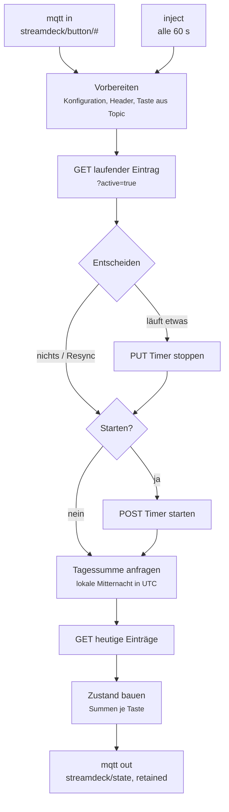

# 5 — Node-RED einrichten

[← Kapitel 4](04-bridge.md) · [Übersicht](../README.md)

Node-RED enthält die gesamte Logik: Es kennt den laufenden Eintrag, entscheidet
über Start, Stopp und Wechsel, rechnet die Tagessummen und schickt das Ergebnis
zurück ans Deck. **Nur hier liegt der API-Token.**

## Aufbau des Flows



Der **Resync alle 60 Sekunden** ist der Grund, warum auch Änderungen wirken, die
nicht vom Deck kommen: Korrekturen im Webinterface, ein an einem anderen Gerät
gestarteter Timer, nachträglich zugewiesene Projekte.

## Flow importieren

Im Editor: **Menü → Import → Datei auswählen** →
[`src/nodered-flow.json`](../src/nodered-flow.json) → **Import**.

Der Flow bringt einen eigenen Tab und einen eigenen MQTT-Broker-Knoten mit.
Existiert bereits ein passender Broker-Knoten mit hinterlegten Zugangsdaten,
lohnt es sich, den mitzubenutzen: Die Broker-Zugangsdaten liegen verschlüsselt
in `flows_cred.json` und lassen sich nicht ohne Weiteres von Hand ergänzen.

Dazu in beiden MQTT-Knoten (`Tastendruck`, `Zustand ans Deck`) den vorhandenen
Broker auswählen.

## Konfiguration anpassen

Im Funktionsknoten **`Vorbereiten`** steht der Konfigurationsblock:

```js
const SD = global.get('solidtime') || {};
const CFG = {
    base:   SD.url   || env.get('SOLIDTIME_URL')   || 'http://solidtime.example.lan:8000',
    token:  SD.token || env.get('SOLIDTIME_TOKEN') || '',
    org:    '…',      // Organisations-ID
    member: '…',      // eigene member_id in dieser Organisation
    user:   '…',      // eigene user_id (für die Tagessumme)
    tz:     'Europe/Berlin',
    keys: {
        0: { project_id: '…', description: 'Projekt A' },
        1: { project_id: '…', description: 'Projekt B' },
        // Die Anzeigetaste taucht hier bewusst NICHT auf.
    }
};
```

Wie man die IDs ermittelt, steht in [Kapitel 6](06-solidtime-api.md).

`tz` beeinflusst nur die Berechnung der lokalen Mitternacht für die Tagessumme.

## Den Token sicher hinterlegen

Der Token gehört **nicht** in den Flow. Sonst enthält jeder Export ein gültiges
Zugangsmittel — und Flow-Exporte landen erfahrungsgemäß in Chats, Tickets und
Repositories.

### Variante A — `functionGlobalContext`

Token in eine eigene Datei, nur für root lesbar:

```bash
sudo tee /pfad/zu/nodered/solidtime.json >/dev/null <<'EOF'
{
  "url": "http://solidtime.example.lan:8000",
  "token": "<SOLIDTIME_TOKEN>"
}
EOF
sudo chmod 600 /pfad/zu/nodered/solidtime.json
```

`tee` schreibt als root, `chmod 600` schließt alle anderen aus. Das
`<<'EOF'` mit **einfachen Anführungszeichen** verhindert, dass die Shell den
Inhalt interpretiert — bei einem Token mit `$` wäre das sonst fatal.

Dann in `settings.js`:

```js
functionGlobalContext: {
    solidtime: (function () {
        try { return require("/config/solidtime.json"); }
        catch (e) { return {}; }
    })(),
},
```

Das `try/catch` ist wichtig: Fehlt die Datei, würde `require` eine Ausnahme
werfen und **Node-RED gar nicht erst starten**. So kommt im Fehlerfall nur ein
leeres Objekt zurück, der Flow meldet „Token nicht gesetzt" und der Rest läuft
weiter.

Syntax prüfen, **bevor** neu gestartet wird:

```bash
node --check settings.js
```

Ein Syntaxfehler in `settings.js` verhindert den Start von Node-RED vollständig.

Danach Node-RED neu starten — nur dann wird `settings.js` neu eingelesen.

> **Beim Node-RED-Addon von Home Assistant** liegt die Konfiguration unter
> `app_configs/<addon-id>/` (im Container als `/config`), **nicht** unter
> `addon_configs/`. Node-RED liest außerdem nicht `settings.js` direkt, sondern
> `/etc/node-red/config.js` — die bindet `/config/settings.js` in der ersten
> Zeile per `require` ein. Ergänzungen wirken also, brauchen aber den Neustart.
>
> Prüfen lässt sich das so:
> ```bash
> docker exec <nodered-container> head -1 /etc/node-red/config.js
> ```

### Variante B — Umgebungsvariablen

Wo man Umgebungsvariablen setzen kann, geht es auch einfacher:

```bash
export SOLIDTIME_URL=http://solidtime.example.lan:8000
export SOLIDTIME_TOKEN=…
```

Der Flow wertet beides aus; `global` hat Vorrang, danach `env`, danach die
Vorgabe im Code.

## Die Falle mit den Headern

Der Flow setzt die Anfrage-Header in **jedem** Knoten neu, obwohl `Vorbereiten`
sie schon gesetzt hat. Das sieht redundant aus, ist es aber nicht:

> **Node-RED ersetzt `msg.headers` nach jeder Antwort durch die
> Response-Header des Servers.**

Wer die Header nur einmal am Anfang setzt, schickt ab dem zweiten Aufruf die
Antwort-Header von Solidtime als eigene Anfrage-Header zurück. Der
`Authorization`-Header fehlt dann — und in der Praxis passiert Schlimmeres: Der
HTTP-Client verrennt sich und versucht einen TLS-Handschlag gegen einen
Klartext-Port:

```
RequestError: write EPROTO … SSL routines:tls_validate_record_header:
wrong version number
```

Diese Meldung führt zuverlässig in die Irre, weil sie nach einem TLS- oder
Zertifikatsproblem aussieht. Die Ursache sind die geerbten Header.

Deshalb steht in jedem betroffenen Knoten:

```js
const authHeaders = () => ({
    'Authorization': 'Bearer ' + CFG.token,
    'Accept': 'application/json',
    'Content-Type': 'application/json'
});
```

und vor jedem Aufruf `msg.headers = authHeaders();`.

## Lokale Mitternacht in UTC

Für die Tagessumme braucht es den Beginn des lokalen Tages, ausgedrückt in UTC.
Naiv wäre das `new Date().setHours(0,0,0,0)` — das ginge von der Zeitzone des
**Servers** aus, und der läuft in einem Container oft auf UTC.

Der Flow rechnet deshalb zeitzonensicher:

```js
const p = new Intl.DateTimeFormat('en-US', {
    timeZone: CFG.tz, hour12: false,
    hour: '2-digit', minute: '2-digit', second: '2-digit'
}).formatToParts(now).reduce((a, x) => (a[x.type] = x.value, a), {});
const intoDay = ((+p.hour) % 24) * 3600 + (+p.minute) * 60 + (+p.second);
const midnight = new Date(now.getTime() - intoDay * 1000)
    .toISOString().replace(/\.\d+Z$/, 'Z');
```

`Intl.DateTimeFormat` gibt die aktuelle Uhrzeit in der **gewünschten** Zone
zurück. Daraus ergibt sich, wie weit der lokale Tag fortgeschritten ist; diese
Spanne von „jetzt" abgezogen ergibt die lokale Mitternacht als UTC-Zeitstempel.
Sommerzeit ist damit automatisch richtig.

`replace(/\.\d+Z$/, 'Z')` entfernt die Millisekunden, weil die API
sekundengenaue Zeitstempel erwartet.

## Der Zustand

```json
{
  "active_key": 9,
  "started_at": "2026-08-16T08:41:02Z",
  "today_base_seconds": 5373,
  "today_by_key": { "9": 5373 }
}
```

| Feld | Bedeutung |
|---|---|
| `active_key` | Taste, die hervorgehoben wird; `null` heißt „keine" |
| `started_at` | Beginn des laufenden Eintrags; `null` heißt „nichts läuft" |
| `today_base_seconds` | heute **abgeschlossen**, über alle Projekte |
| `today_by_key` | heute abgeschlossen, je Taste |

Die laufende Zeit steht bewusst **nicht** darin — die addiert die Bridge selbst
aus `started_at`. Sonst müsste jede Sekunde eine Nachricht fließen.

`active_key: null` bei gesetztem `started_at` ist ein regulärer Zustand: Es
läuft etwas, das keiner Taste zugeordnet ist. Die Tagesanzeige zählt es
trotzdem mit.

Die Nachricht wird **retained** mit QoS 1 gesendet. Dadurch bekommt die Bridge
nach einem Neustart sofort den aktuellen Zustand, ohne bis zum nächsten
Resync-Tick warten zu müssen.

## Prüfen

Mitlauschen:

```bash
mosquitto_sub -h <broker> -u <benutzer> -P <passwort> -t 'streamdeck/#' -v
```

`-v` zeigt Topic **und** Inhalt. Erwartet wird mindestens einmal pro Minute eine
Nachricht auf `streamdeck/state`.

Einen Zustand von Hand vorgeben, um das Rendern ohne Solidtime zu prüfen:

```bash
mosquitto_pub -h <broker> -u <benutzer> -P <passwort> \
  -t streamdeck/state -q 1 \
  -m '{"active_key":0,"started_at":"2026-08-16T07:38:45Z","today_base_seconds":3600}'
```

Danach muss Taste 1 grün mit Rahmen und laufender Zeit erscheinen.

---

[Weiter: 6 — Die Solidtime-API →](06-solidtime-api.md)
