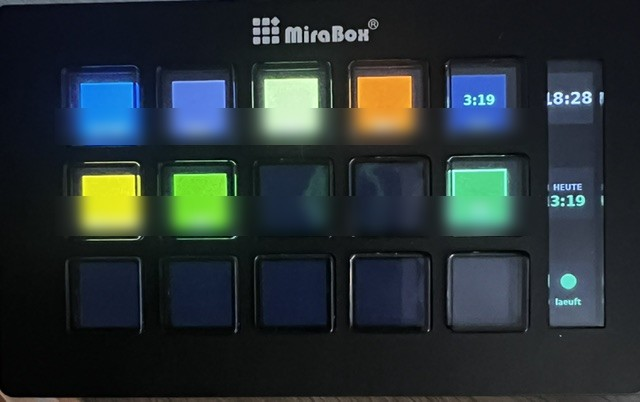
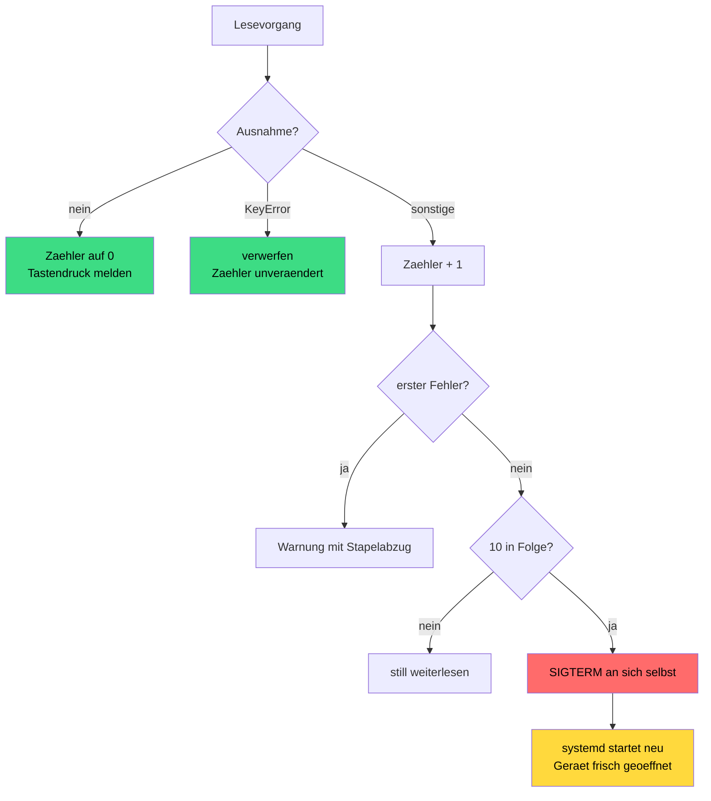

# 9 — MiraBox Stream Dock statt Elgato

[← Kapitel 8](08-lessons-learned.md) · [Übersicht](../README.md)

IceDeck läuft auch mit einem **MiraBox Stream Dock**. Getestet mit dem
**293S** — dieselbe Bridge, derselbe Node-RED-Flow, dieselbe Tastenbelegung.

## Welches Gerät genau



*Das getestete Gerät im Betrieb. Links die 15 Tasten in 5×3, rechts der
schmale Streifen mit Uhrzeit, Tagessumme und Statusampel. Die dritte
Tastenreihe ist unbelegt und bleibt dunkel.*

Damit sich ein baugleiches Modell nachbestellen lässt, hier die vollständige
Kennung des getesteten Geräts:

| | |
|---|---|
| Handelsname | **MiraBox Visual Stream Deck Black** |
| Modell laut Verpackung | **HSV 239S** |
| Hersteller | MiraBox (Product Mbox), Hersteller-Software unter `key123.vip` |
| Meldet sich als | **Stream Dock 293S** |
| USB-Kennung | `5548:6670` |
| Firmware | `V2.293S.00.003` |
| Tasten | 15 in 5×3, Tastenbild 85×85 JPEG, 90° gedreht |
| Seitenstreifen | drei Felder à 80×80, reine Anzeige |

> **Achtung, zwei verschiedene Nummern.** Auf der Verpackung steht `HSV 239S`,
> das Gerät selbst meldet `293S` — die Ziffern sind vertauscht. Wer nach „239S"
> sucht, findet Angebote; wer Software oder Bibliotheken sucht, muss nach
> **„Stream Dock 293S"** suchen. Beim Bestellen ist die maßgebliche Angabe
> **15 Tasten in 5×3 plus seitlicher Streifen**.

Die Bibliothek kennt außerdem `293`, `N3`, `N4` und `N4EN` (siehe udev-Regel
unten). Ob die laufen, wurde **nicht** geprüft. Sicher ist nur: Ein Modell mit
derselben 5×3-Anordnung braucht keine Änderung an Flow oder Tastenbelegung.

## „Elgato-kompatibel" stimmt nicht, wie man denkt

MiraBox bewirbt seine Geräte als Elgato-kompatibel. Gemeint ist die
**Plugin-Ebene der Windows-Software** — die kann Elgato-Plugins laden.

Auf USB-Ebene ist **nichts** kompatibel:

| | Elgato Original V2 | MiraBox 293S |
|---|---|---|
| USB-Kennung | `0fd9:006d` | `5548:6670` |
| Tastenbild | 72×72 | 85×85 |
| Drehung | 0° | 90° |
| Protokoll | Elgato | eigenes |

`python-elgato-streamdeck` findet ein MiraBox-Gerät nicht einmal. Der Beleg
liegt in den Projekten selbst: Es gibt einen eigenen Fork der Bibliothek nur für
MiraBox, ein Projekt namens „reverse-engineered communication protocol" und
einen offenen Pull Request, der 293S-Unterstützung nachrüstet.

Was rettet: Das **293S hat 15 Tasten in 5×3** — exakt dieselbe Geometrie wie das
Elgato-Modell. Tastenbelegung und Flow bleiben unverändert.

## Was zu tun ist

### 1. Die passende Bibliothek

[`python-streamdoeck`](https://github.com/StreamDoeck/python-streamdoeck) kennt
beide Gerätefamilien. In eine **getrennte** Umgebung installieren, damit die
laufende Installation unangetastet bleibt:

```bash
sudo mkdir -p /opt/icedeck-mirabox && sudo chown "$USER" /opt/icedeck-mirabox
python3 -m venv /opt/icedeck-mirabox/venv
/opt/icedeck-mirabox/venv/bin/pip install --upgrade pip
sudo apt-get install -y git
/opt/icedeck-mirabox/venv/bin/pip install \
    "git+https://github.com/StreamDoeck/python-streamdoeck.git" pillow paho-mqtt
```

`git` wird gebraucht, weil das Paket nicht auf PyPI liegt und pip es klonen muss.

### 2. Der fehlende-Assets-Fehler

> **Ohne diesen Schritt lässt sich die Bibliothek gar nicht benutzen.**

Im gebauten Paket **fehlen die Dateien `Assets/black-*.jpg`**. Jedes
Gerätemodul lädt sie beim Import, deshalb scheitert schon `import`:

```
FileNotFoundError: .../StreamDeck/ImageHelpers/../../Assets/black-85x85.jpg
```

Der Pfad zeigt eine Ebene **über** dem Paket — die Dateien gehören nach
`site-packages/Assets/`, nicht nach `site-packages/StreamDeck/Assets/`.

Es sind schlichte schwarze Flächen, also selbst erzeugen:

```bash
/opt/icedeck-mirabox/venv/bin/python - <<'EOF'
import os
from PIL import Image
ziel = "/opt/icedeck-mirabox/venv/lib/python3.13/site-packages/Assets"
os.makedirs(ziel, exist_ok=True)
for g in ["100x100", "120x120", "120x800", "126x126", "176x112", "248x58",
          "64x64", "72x72", "80x80", "85x85", "96x96"]:
    w, h = map(int, g.split("x"))
    Image.new("RGB", (w, h), (0, 0, 0)).save(f"{ziel}/black-{g}.jpg", "JPEG", quality=95)
EOF
```

**Diese Krücke überlebt kein Update der Bibliothek.** Nach jedem `pip install
--upgrade` neu anlegen.

### 3. udev-Regel

[`src/99-mirabox.rules`](../src/99-mirabox.rules) deckt alle vier bekannten
Hersteller-IDs ab:

| ID | Modelle |
|---|---|
| `0x5500` | Stream Dock 293 |
| `0x5548` | Stream Dock 293S |
| `0x6602` | Stream Dock N4 |
| `0x6603` | Stream Dock N3, N4EN |

```bash
sudo cp src/99-mirabox.rules /etc/udev/rules.d/
sudo udevadm control --reload-rules && sudo udevadm trigger
```

### 4. Eine Zeile im Code

Der Fork nennt den Bildhelfer `NativeImageHelper` statt `PILHelper`. Die
benutzten Funktionen heißen identisch, es genügt ein toleranter Import — so
läuft **dieselbe Datei** mit beiden Gerätefamilien:

```python
try:
    from StreamDeck.ImageHelpers import PILHelper
except ImportError:
    from StreamDeck.ImageHelpers import NativeImageHelper as PILHelper
```

### 5. Umschalten ohne Rückbau

Statt die Unit zu ändern, eine Ergänzungsdatei anlegen:

```bash
sudo mkdir -p /etc/systemd/system/icedeck.service.d
sudo tee /etc/systemd/system/icedeck.service.d/10-mirabox.conf >/dev/null <<'EOF'
[Service]
ExecStart=
ExecStart=/opt/icedeck-mirabox/venv/bin/python /opt/icedeck-mirabox/streamdeck_bridge.py
EOF
sudo systemctl daemon-reload && sudo systemctl restart icedeck
```

Die leere `ExecStart=`-Zeile ist Pflicht: Ohne sie **ergänzt** systemd den
Befehl, statt ihn zu ersetzen, und die Unit wird ungültig.

Zurück zur Originalbibliothek:

```bash
sudo rm /etc/systemd/system/icedeck.service.d/10-mirabox.conf
sudo systemctl daemon-reload && sudo systemctl restart icedeck
```

## Der Seitenstreifen

Das 293S hat neben den 15 Tasten einen schmalen Streifen an der Seite. Die
Messung am Gerät ergab:

| | |
|---|---|
| Felder | **drei**, je 80×80, senkrecht gestapelt |
| Geräte-IDs | `0x10`, `0x11`, `0x12` |
| Drehung | 90° |
| Eingabe | **keine** — reine Anzeige, kein Taster |

Die Abstände zwischen den Feldern entstehen in der Firmware. Ein viertes Feld
gibt es nicht; die drei Kennungen sind fest verdrahtet.

IceDeck zeigt dort Uhrzeit, Tagessumme und eine Statusampel. Die Bridge prüft
vorher, ob das Gerät den Streifen hat **und** ob die Bibliothek die nötigen
Funktionen kennt — an einem Elgato wird der Teil übersprungen:

```python
def hat_seitenstreifen(deck):
    return (
        getattr(deck, "SECONDARY_IMAGE_COUNT", 0) > 0
        and hasattr(deck, "set_secondary_image")
        and hasattr(PILHelper, "create_secondary_image")
    )
```

Im Ruhezustand zeichnet der Timer **nur** diese drei Felder neu, damit die Uhr
weiterläuft. Alle 15 Tastenbilder alle zehn Sekunden zu erneuern wäre auf einem
Zero 2 W unnötige Dauerlast.

## Hintergrundbild: möglich, aber nicht empfohlen

Das 293S hat **ein einziges LCD**; die 15 „Tasten" sind Ausschnitte darauf.
`set_screen_image()` bemalt die gesamte Fläche, `set_key_image()` überschreibt
danach die einzelnen Bereiche. Ein Hintergrund bleibt also nur in den **Lücken
zwischen den Tasten** sichtbar — und nur, solange kein `reset()` läuft.

Die Messwerte:

| | |
|---|---|
| Format | **rohe RGB-Pixel**, nicht JPEG — trotz gegenteiliger Angabe im Code |
| Größe | **480×854** (1.229.760 Bytes). 854×480 wird abgelehnt. |
| Dauer | rund 9,5 Sekunden Übertragung |

Der interne Befehl heißt `CRT_LOG`. Die Hersteller-Software nutzt dieselbe
Fläche für Wallpaper und animierte Hintergründe.

**Zwei Fallstricke:**

Der dokumentierte Weg über `to_native_screen_format()` scheitert mit
`bytearray index out of range`. `set_screen_image` vertauscht Bytes im
Dreierschritt (RGB→BGR) — eine JPEG-Länge ist selten durch 3 teilbar. Das
verrät zugleich, dass rohe Pixel erwartet werden.

Schwerwiegender: Während der Übertragung **stirbt der Lesethread** mit
`KeyError: 0` in `_read_control_states`. Danach meldet keine Taste mehr etwas.

Für einen kosmetischen Hintergrund bleibt das ein schlechtes Geschäft — er wäre
ohnehin nur in den Tastenlücken sichtbar. Wer es trotzdem will, sollte das Bild
**einmal beim Dienststart** setzen, nach `reset()` und vor den Tastenbildern.

## Der tödliche Lesefehler

Auch ohne Hintergrundbild ist dieser Fehler eine Zeitbombe, deshalb fängt
IceDeck ihn ab. Die Ursache:

```python
if device_input_data and device_input_data.startswith(Mirabox.ACK_OK):
    triggered_raw_key = device_input_data[9]
    triggered_key = self.DEVICE_KEY_ID_TO_KEY_NUM[triggered_raw_key]   # KeyError
```

Gültige Tastenkennungen sind `0x01` bis `0x0f`. Die **Quittung eines
Befehls** beginnt aber ebenfalls mit `ACK_OK` und trägt an Byte 9 eine `0` —
die steht in keiner Zuordnung. Die Ausnahme fliegt bis in den Lesethread und
beendet ihn.

Das Tückische daran: Der Dienst läuft weiter, die Tastenbilder werden weiter
gezeichnet, MQTT bleibt verbunden. Nur **Tastendrücke kommen nicht mehr an**.
Nichts im Protokoll deutet darauf hin.

IceDeck setzt dagegen zwei Sicherungen, beide in `streamdeck_bridge.py` und
**nicht** in der Bibliothek — ein Patch in `site-packages` wäre beim nächsten
`pip install --upgrade` verloren:

**1. Der Fang.** `lesethread_absichern()` legt sich vor `_read_control_states`
und verwirft Antworten ohne Tastenkennung, statt sie eskalieren zu lassen:

```python
def sicher(self):
    try:
        return original(self)
    except KeyError as e:
        log.debug("Geraeteantwort ohne Tastenkennung verworfen (%s)", e)
        return None
    except Exception:
        log.warning("Lesen der Tastenzustaende fehlgeschlagen", exc_info=True)
        return None
```

`None` ist der reguläre Rückgabewert für „nichts passiert" — der Thread wartet
kurz und liest weiter. Der Fang muss **vor** `deck.open()` greifen, denn dort
wird der Thread gestartet.

**2. Der Wächter.** Sollte der Thread doch einmal sterben, prüft der
Zehn-Sekunden-Takt seinen Zustand und setzt ihn neu auf:

```python
if not lesethread_lebt(deck):
    lesethread_wiederbeleben(deck)
```

Ein Gerät ohne Lesethread (der Elgato-Pfad kennt das Attribut nicht) gilt dabei
als gesund, damit kein Fehlalarm entsteht.

## Wenn Verschlucken die falsche Antwort ist

Der erste Entwurf dieser Absicherung fing **jede** Ausnahme ab und gab `None`
zurück. Im Betrieb zeigte sich, warum das zu grob ist.

Das Gerät meldete sich unvermittelt neu am USB-Bus an:

```
usb 1-1: USB disconnect, device number 4
usb 1-1: device descriptor read/all, error -71
usb 1-1: New USB device found, idVendor=5548, idProduct=6670
```

Damit war der Zugriff der Bridge ungültig — **jeder** weitere Lesevorgang
scheiterte mit `TransportError: Failed to read in report (-1)`. Der Fang
verschluckte auch das. Ergebnis: rund **17 Fehler je Sekunde**, über tausend
Protokollzeilen je Minute, und die Tasten blieben trotzdem stumm.

Aus einem tot liegenden Lesethread war ein leer drehender geworden. Beide
Zustände sehen von außen gleich aus: Dienst `active`, MQTT verbunden, Bilder
werden gezeichnet, keine Taste meldet sich. Der zweite kostet zusätzlich
Rechenzeit und flutet das Protokoll.

**Die Lehre: Ein Fang, der nicht unterscheidet, verschiebt den Ausfall nur.**



Die beiden Fehler haben nichts gemeinsam:

| | `KeyError` | `TransportError` |
|---|---|---|
| Bedeutet | eine Quittung, keine Taste | der USB-Zugriff gilt nicht mehr |
| Tritt auf | vereinzelt, im Normalbetrieb | ab jetzt bei **jedem** Lesevorgang |
| Richtige Antwort | verschlucken | aufgeben und neu starten |

IceDeck zählt deshalb **aufeinanderfolgende** Fehler, die kein `KeyError` sind.
Ein erfolgreicher Lesevorgang setzt den Zähler zurück. Erst eine Serie belegt,
dass der Zugriff dauerhaft hinüber ist:

```python
elif n >= GRENZE_TOT and not getattr(self, "_sdb_aufgegeben", False):
    self._sdb_aufgegeben = True
    log.error("%d Lesefehler in Folge - der USB-Zugriff gilt nicht mehr. ...", n)
    os.kill(os.getpid(), signal.SIGTERM)
```

Warum beenden statt neu verbinden? Weil ein neuer Lesethread auf demselben
ungültigen Zugriff genauso leer drehen würde. Nur ein frisches `open()` hilft,
und das gibt es am einfachsten über `Restart=always` in der Unit. Das Signal
geht bewusst durch den regulären Abschaltpfad, damit MQTT sauber getrennt und
das Deck geschlossen wird.

Zwei Details, die den Unterschied machen:

**Nur der erste Fehler bekommt den vollen Stapelabzug.** Sonst ertränkt eine
Störung das Protokoll, bevor man die Ursache lesen kann.

**Die Grenze liegt bei zehn.** Bei rund 17 Lesevorgängen je Sekunde ist das
weniger als eine Sekunde — schnell genug, dass niemand es merkt, und weit genug
weg von einer einzelnen Störung.

Dieselbe Überlegung gilt für den Zehn-Sekunden-Takt: Bricht dort das Zeichnen
ab, stirbt der Thread und die Uhr steht für immer still, während Dienst und
Tasten weiterlaufen. Auch das ist jetzt gefangen und protokolliert.

Nachgewiesen wurde beides gegen ein nachgebautes Gerät, das genau die tödliche
Antwort liefert: ungeschützt `KeyError: 0`, mit Fang dreimal sauberes `None`,
Wächter erkennt lebenden, toten und fehlenden Thread korrekt, Wiederbelebung
startet einen neuen und lässt sich sauber beenden.

## Bekannte Einschränkungen

- Die 293S-Unterstützung nennt sich im Quelltext selbst „non-official"
- Die fehlenden Assets müssen nach jedem Bibliotheks-Update neu angelegt werden
- Ob andere Modelle (293, N3, N4) laufen, wurde nicht geprüft — die Bibliothek
  kennt sie, getestet wurde nur das 293S
- Der Seitenstreifen hat nur drei Felder; mehr gibt die Firmware nicht her

Behoben, aber erwähnenswert: Der `KeyError` im Lesethread wird abgefangen, die
Ursache liegt aber weiter in der Bibliothek. Wer IceDeck ohne diese Absicherung
betreibt, verliert früher oder später die Tasteneingabe.

Ebenfalls behoben: Meldet sich das Gerät neu am USB-Bus an, beendet sich der
Dienst und wird von systemd neu gestartet. Das dauert rund zwei Sekunden, in
denen keine Taste reagiert. Warum das Gerät sich neu anmeldet, ist ungeklärt —
die Stromversorgung war es nachweislich nicht (`vcgencmd get_throttled`
meldete `0x0`).

---

[Kapitel 10 →](10-wlan-vpn.md) · [Übersicht](../README.md)
