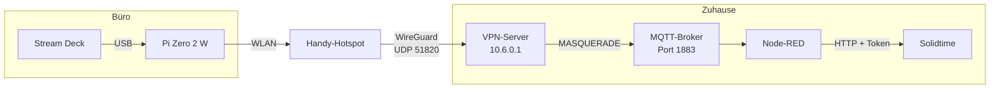
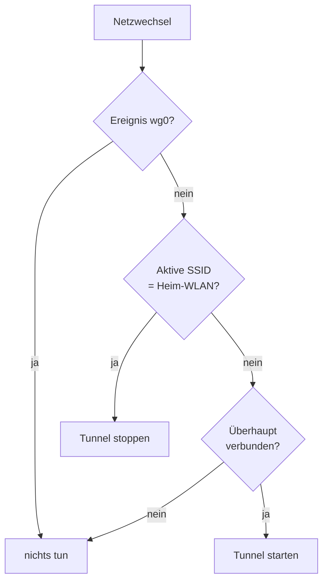

# 10 — Unterwegs: Hotspot-Rückfall und VPN

[← Kapitel 9](09-mirabox.md) · [Übersicht](../README.md)

Bis hierhin hängt das Deck im Heim-WLAN. Im Büro gibt es das nicht — und damit
keinen Weg zum MQTT-Broker. Dieses Kapitel macht das Deck ortsunabhängig: Ist
das Heim-WLAN nicht da, verbindet sich der Pi mit einem Handy-Hotspot und holt
sich den Broker über einen WireGuard-Tunnel nach Hause.

## Der häufigste Denkfehler zuerst

> „Der Pi muss doch Solidtime erreichen."

Nein. **Der Pi spricht nie mit Solidtime.** Er kennt nur den MQTT-Broker; die
gesamte Solidtime-Logik samt Token liegt in Node-RED (siehe
[Kapitel 5](05-nodered.md)). Der Tunnel muss also genau **einen** Dienst
erreichbar machen: den Broker auf Port 1883.

Das ist der Grund, warum ein sehr enger Split-Tunnel genügt.



## Eine Adresse für beide Wege

Der Broker läuft auf einem Rechner mit mehreren Netzwerkadressen — eine im
IoT-Netz, eine im Heimnetz. Bisher nutzte der Pi die IoT-Adresse.

Stellt man ihn auf die **Heimnetz-Adresse** um, funktioniert dieselbe Adresse in
beiden Lagen:

| Wo | Weg zur Broker-Adresse |
|---|---|
| Zuhause | direkt geroutet, kein Tunnel |
| Unterwegs | durch den WireGuard-Tunnel |

Damit braucht die Bridge **keine Fallunterscheidung**. Sie kennt eine Adresse,
und das Routing entscheidet. Das ist der ganze Trick dieses Kapitels.

Prüfen, ob die Heimnetz-Adresse auch aus dem IoT-Netz erreichbar ist — sonst
trägt der Umbau zu Hause nicht:

```bash
ssh pi 'timeout 5 python3 -c "
import socket; s=socket.create_connection((\"BROKER_IP\",1883),4)
print(\"erreichbar via\", s.getsockname()); s.close()"'
```

## 1 — WLAN-Profile mit Rangfolge

NetworkManager wählt unter mehreren bekannten Netzen das mit der höchsten
`autoconnect-priority`. Damit lässt sich die Reihenfolge festlegen, ohne eine
Zeile Code:

```bash
# Heim-WLAN gewinnt immer
sudo nmcli connection modify "HEIM_SSID" connection.autoconnect-priority 100

# Diensthandy vor Privathandy
sudo nmcli connection add type wifi con-name "DIENST_SSID" ifname wlan0 \
     ssid "DIENST_SSID" wifi-sec.key-mgmt wpa-psk wifi-sec.psk "GEHEIM" \
     connection.autoconnect yes connection.autoconnect-priority 50

sudo nmcli connection add type wifi con-name "PRIVAT_SSID" ifname wlan0 \
     ssid "PRIVAT_SSID" wifi-sec.key-mgmt wpa-psk wifi-sec.psk "GEHEIM" \
     connection.autoconnect yes connection.autoconnect-priority 10
```

Die Profile enthalten Klartext-Passwörter. NetworkManager legt sie unter
`/etc/NetworkManager/system-connections/` ab — Rechte prüfen:

```bash
sudo chmod 600 /etc/NetworkManager/system-connections/*.nmconnection
```

Kontrolle:

```bash
nmcli -f NAME,AUTOCONNECT,AUTOCONNECT-PRIORITY connection show
```

> **Der Pi Zero 2 W kann nur 2,4 GHz.** Beim iPhone muss im Hotspot
> **„Kompatibilität maximieren"** eingeschaltet sein, sonst sendet er auf 5 GHz
> und der Pi sieht das Netz gar nicht.

## 2 — WireGuard auf dem Pi

```bash
sudo apt-get install -y wireguard-tools
```

Das Kernelmodul ist in aktuellen Pi-Kerneln fest eingebaut, ein
`wireguard-dkms` wird nicht gebraucht:

```bash
sudo modprobe wireguard && echo ok
```

Schlüsselpaar erzeugen. **Der private Schlüssel verlässt den Pi nie** — nur der
öffentliche wandert zum Server:

```bash
sudo install -d -m 700 /etc/wireguard
wg genkey | sudo tee /etc/wireguard/privatekey >/dev/null
sudo chmod 600 /etc/wireguard/privatekey
sudo sh -c 'wg pubkey < /etc/wireguard/privatekey > /etc/wireguard/publickey'
sudo cat /etc/wireguard/publickey
```

## 3 — Peer auf dem VPN-Server

Erst sichern:

```bash
sudo cp /etc/wireguard/wg0.conf /etc/wireguard/wg0.conf.bak-$(date +%F-%H%M%S)
```

Peer anhängen — eine freie Adresse aus dem Tunnelnetz, als `/32`:

```bash
sudo tee -a /etc/wireguard/wg0.conf >/dev/null <<'EOF'

[Peer]
# Stream Deck Pi Zero 2 W (IceDeck)
PublicKey = OEFFENTLICHER_SCHLUESSEL_DES_PI
AllowedIPs = 10.6.0.3/32
EOF
```

Jetzt der wichtige Teil — **nicht** `systemctl restart wg-quick@wg0`. Das würde
alle bestehenden Tunnel kappen. `syncconf` nimmt die Änderung im laufenden
Betrieb auf:

```bash
sudo wg syncconf wg0 <(wg-quick strip wg0)
sudo wg show wg0 peers
```

`wg-quick strip` entfernt die `PostUp`/`PostDown`-Zeilen, die `wg setconf` nicht
kennt. Die iptables-Regeln stehen ohnehin schon, weil der Tunnel läuft.

Damit der neue Peer das Heimnetz erreicht, muss der Server bereits NAT machen —
in einer bestehenden Installation ist das der Fall. Nachprüfen:

```bash
sudo iptables -t nat -S POSTROUTING | grep 10.6.0.0
sysctl net.ipv4.ip_forward
```

**Es ist keinerlei Änderung am Broker-Rechner nötig.** Der Server maskiert die
Tunneladressen hinter seiner eigenen; für den Broker sieht das aus wie ein
ganz normaler Zugriff aus dem Heimnetz.

## 4 — Client-Konfiguration

[`src/wg0.example.conf`](../src/wg0.example.conf) nach
`/etc/wireguard/wg0.conf` auf dem Pi, Platzhalter ersetzen, `chmod 600`.

Zwei Zeilen tragen die Last:

```ini
# Split-Tunnel: NUR das Heimnetz und das Tunnelnetz.
AllowedIPs = 192.168.178.0/24, 10.6.0.0/24
# Haelt die NAT-Zuordnung im Mobilfunknetz offen.
PersistentKeepalive = 25
```

`AllowedIPs` ist bei WireGuard beides zugleich: die Liste erlaubter
Absenderadressen **und** die Routingtabelle. Stünde hier `0.0.0.0/0`, liefe
auch das Büro-Internet durch die heimische Leitung — langsam und unnötig.

> **Das Tunnelnetz muss mit hinein.** Steht dort nur das Heimnetz, ist der Pi
> unterwegs **nicht fernwartbar**, und die Ursache ist gut versteckt: Ein
> `ssh` oder `ping` vom VPN-Server trägt als Absender dessen Tunneladresse
> `10.6.0.1`. Die steht dann in keiner erlaubten Liste, also verwirft
> WireGuard das Paket stillschweigend. `wg show` meldet dabei einen frischen
> Handshake, der Tunnel sieht kerngesund aus — nur antwortet niemand.
>
> Prüfen lässt sich das mit einer erlaubten Quelladresse: `ping -I <LAN-IP des
> Servers> 10.6.0.3` kommt durch, `ping 10.6.0.3` nicht. Nachträglich beheben
> ohne den Tunnel zu unterbrechen:
>
> ```bash
> sudo wg set wg0 peer SERVER_PUBKEY allowed-ips 192.168.178.0/24,10.6.0.0/24
> ```

`PersistentKeepalive` ist im Mobilfunk kein Luxus: Ohne Verkehr vergisst das
Carrier-NAT die Zuordnung nach kurzer Zeit, und der Server kann den Pi nicht
mehr erreichen. Alle 25 Sekunden ein Byte hält den Weg offen.

## 5 — Tunnel nur außerhalb des Heim-WLANs

Der Autostart bleibt **aus**:

```bash
systemctl is-enabled wg-quick@wg0   # disabled - so soll es sein
```

Warum? Zu Hause ist das Heimnetz direkt geroutet. Ein aktiver Tunnel legt eine
Route dorthin über `wg0`. Fällt der Tunnel aus, ist der funktionierende direkte
Weg mit begraben — man tauscht einen sicheren Pfad gegen einen fragilen.

Ein NetworkManager-Dispatcher entscheidet stattdessen bei jedem Netzwechsel.
[`src/90-icedeck-vpn`](../src/90-icedeck-vpn) installieren:

```bash
sudo install -o root -g root -m 755 src/90-icedeck-vpn \
     /etc/NetworkManager/dispatcher.d/90-icedeck-vpn
```

Die Rechte sind Bedingung, nicht Kosmetik: NetworkManager führt nur Skripte
aus, die root gehören und für andere nicht schreibbar sind — sonst könnte
jeder Benutzer Code als root ausführen lassen.

Die Logik in drei Zeilen:



Drei Feinheiten stecken darin:

**Selbstaufruf abfangen.** Der Tunnel erzeugt beim Hochkommen selbst ein
`up`-Ereignis. Ohne `[ "$IFACE" = "wg0" ] && exit 0` ruft sich das Skript
rekursiv auf.

**SSID mit Sonderzeichen.** `nmcli -t` trennt Felder mit Doppelpunkten, und
eine SSID darf welche enthalten. Deshalb wird ab dem ersten Doppelpunkt alles
übernommen statt `$2` zu nehmen:

```sh
| awk -F: '$1 == "yes" { print substr($0, index($0, ":") + 1); exit }'
```

**Nicht blockieren.** `systemctl --no-block` gibt sofort zurück.
NetworkManager beendet Dispatcher-Skripte, die zu lange brauchen — und
`wg-quick up` muss erst einen DNS-Namen auflösen.

## 6 — Broker-Adresse umstellen

Zum Schluss, wenn alles andere steht:

```bash
sudo cp /etc/streamdeck-solidtime/config.json \
        /etc/streamdeck-solidtime/config.json.bak-$(date +%F-%H%M%S)
sudo nano /etc/streamdeck-solidtime/config.json   # mqtt.host anpassen
sudo systemctl restart icedeck
```

Im Protokoll muss stehen:

```
INFO MQTT verbunden (rc=Success), abonniere streamdeck/state
INFO Neuer Zustand: {'active_key': 9, ...}
```

## Testen, ohne wegzufahren

Alle drei Zweige lassen sich zu Hause prüfen.

**Handshake über die eigene öffentliche Adresse.** Viele Router können das
(Hairpin-NAT), dann funktioniert der komplette Test daheim:

```bash
sudo wg-quick up wg0
sleep 5 && sudo wg show wg0        # "latest handshake: ... seconds ago"
```

**Beweis, dass der Verkehr wirklich durch den Tunnel geht** — die Quelladresse
muss die Tunneladresse sein, nicht die WLAN-Adresse:

```bash
timeout 8 python3 -c "
import socket; s=socket.create_connection(('BROKER_IP',1883),5)
print('Quelladresse:', s.getsockname()); s.close()"
# -> Quelladresse: ('10.6.0.3', 58136)
```

**Dispatcher, Zweig „fremdes Netz"** — mit einer Kopie, in der die Heim-SSID
auf etwas Nichtexistierendes zeigt:

```bash
sudo sed 's/^HEIM_SSID=.*/HEIM_SSID="GibtEsNicht"/' \
     /etc/NetworkManager/dispatcher.d/90-icedeck-vpn | sudo tee /tmp/t >/dev/null
sudo chmod 755 /tmp/t && sudo /tmp/t wlan0 up
sleep 8 && systemctl is-active wg-quick@wg0     # active
sudo rm /tmp/t
```

**Dispatcher, Zweig „zu Hause"** — das Original hinterher, der Tunnel muss
wieder verschwinden:

```bash
sudo /etc/NetworkManager/dispatcher.d/90-icedeck-vpn wlan0 up
sleep 4 && systemctl is-active wg-quick@wg0     # inactive
ip route get BROKER_IP                          # wieder direkt über wlan0
```

## Der Ernstfall-Test, ohne den Pi zu verlieren

Wer das Heim-WLAN wirklich abschaltet, kappt damit auch die eigene
SSH-Sitzung. Zwei Vorkehrungen machen das ungefährlich.

**Erst ein Rückfahrschein.** Ein Einmal-Timer stellt das Heim-WLAN nach einer
halben Stunde von selbst wieder her — auch dann, wenn gar nichts mehr geht:

```bash
sudo systemd-run --on-active=1800 --unit=wlan-rettung /bin/sh -c \
  'nmcli connection modify HEIM_SSID connection.autoconnect yes;
   nmcli connection up HEIM_SSID'
```

**Dann losgelöst umschalten.** Ohne `systemd-run` stirbt der Befehl mitten
im Vorgang, weil er die eigene Verbindung abbaut, die ihn gerade transportiert:

```bash
sudo systemd-run --unit=wlan-test /bin/sh -c \
  'nmcli connection modify HEIM_SSID connection.autoconnect no;
   nmcli connection down HEIM_SSID'
```

NetworkManager greift dann zum Profil mit der nächsthöheren Priorität, der
Dispatcher startet den Tunnel, und nach einer knappen Minute ist der Pi unter
`10.6.0.3` wieder da. Kontrolle am VPN-Server, noch bevor man selbst
hineinkommt — ein Endpunkt aus dem Mobilfunknetz beweist den Ortswechsel:

```bash
sudo wg show wg0
# endpoint: 109.x.x.x:19396      <- Mobilfunk, nicht das eigene Netz
# latest handshake: 1 minute, 1 second ago
```

Zurück geht es mit `autoconnect yes` und `nmcli connection up HEIM_SSID`;
danach den Rettungs-Timer wegräumen:

```bash
sudo systemctl stop wlan-rettung.timer
```

## Fernwartung, während das Deck im Büro steht

Am Hotspot bekommt der Pi eine Adresse aus dem Handy-Netz (beim iPhone
`172.20.10.x`) — von zu Hause aus nicht erreichbar. Seine **Tunneladresse** ist
es dagegen sehr wohl. Der VPN-Server dient als Sprungbrett:

```bash
ssh -J root@VPN_SERVER mpauli@10.6.0.3
```

`-J` baut nur eine TCP-Weiterleitung; die Anmeldung am Pi passiert Ende zu Ende,
der Server sieht die Sitzung nicht im Klartext.

Setzt das voraus, dass das Tunnelnetz in `AllowedIPs` steht — sonst
verschwinden die Pakete lautlos, siehe Kasten oben.

## Was das nicht kann

**Tastendrücke gehen ohne Verbindung verloren.** Die Bridge veröffentlicht
einen Druck und vergisst ihn. Ist der Broker gerade nicht erreichbar — Hotspot
aus, Funkloch, Tunnel im Aufbau — passiert nichts, und das Tastenbild ändert
sich nicht. Ein lokaler Puffer mit Nachsendung wäre nachrüstbar, ist hier aber
bewusst nicht eingebaut: Ein nachträglich gestarteter Zeiteintrag mit falschem
Zeitstempel ist schlimmer als ein verlorener Tastendruck, den man sofort sieht.

**Der Hotspot muss an sein.** NetworkManager verbindet sich nur mit einem Netz,
das funkt. Ein iPhone schaltet den Hotspot ab, wenn längere Zeit kein Gerät
verbunden ist.

**Der Tunnel hängt am DynDNS-Namen.** Ändert sich die heimische IP-Adresse und
der DynDNS-Eintrag hinkt nach, findet `wg-quick up` den Endpunkt nicht.
`systemctl restart wg-quick@wg0` löst den Namen neu auf.

## Sicherheitsgewinn nebenbei

Im Heimnetz laufen die MQTT-Zugangsdaten unverschlüsselt über Port 1883 — das
ist dort vertretbar. In einem fremden WLAN wäre es das nicht. Da der Tunnel
außerhalb des Heim-WLANs **immer** steht, verlässt der Broker-Verkehr den Pi
unterwegs nur verschlüsselt.

---

[← Zurück zur Übersicht](../README.md)
